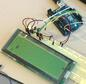

---
tags:
  - FAQ
  - frequently asked questions
---

# FAQ

## What is the goal of the workshop?

See [the goal at the front page](README.md#goal).

## How does the end result look like?

You will at least have an Arduino with a minimal program uploaded onto it.

It will look similar, but less complex, than this:

## Can I keep the Arduino?

If you have brought one.

If you do not bring an Arduino Uno, you will use one from the Saturday courses.

## What can I do after this workshop?

After this workshop, you have:

- used at least one of the
  ['Arduino för ungdomar' booklets](https://richelbilderbeek.github.io/arduino_foer_ungdomar/).
- used an Arduino
- uploaded a minimal program to an Arduino

## At what level is the workshop taught?

At the level of the absolute beginner:
you need to know nothing.

## What do I need to bring?

Nothing.

We will be using the UMS laptops, the printed booklets of
['Arduino för ungdomar' booklets](https://richelbilderbeek.github.io/arduino_foer_ungdomar/)
and the Arduino Uno's from the Saturday courses.
All of these are present at UMS.

However:

- If you want to view the booklets digitally (e.g. for bigger font size),
  then you can use a UMS laptop. Or you use your phone. Or you bring your
  own laptop :-)
- If you want to use your own Arduino Uno: bring your own Arduino Uno

## Can I bring another type of Arduino?

No.

Using another type of Arduino (e.g. the smaller Arduino Nano
or the bigger Arduino Mega) is beyond the scope of this workshop.

## In which language will this workshop be taught?

In English, because that is the most inclusive language.

Questions can be asked in Swedish too.

## Why is the workshop in English when the booklets are in Swedish?

Because the
['Arduino för ungdomar' booklets](https://richelbilderbeek.github.io/arduino_foer_ungdomar/)
are available digitally and hence can be translated automatically
in any modern internet browser.

## How much does this workshop cost?

Nothing.

If you want to use your own Arduino: bring your own Arduino.

## Where do I need to register?

You do not need to register: just show up on time :-)

## Who teaches the workshop?

Richèl, pronounced as 'rea-shell' and rhymes with 'sea shell'.

???- question "How does Richèl look like?"

    He looks similar to this:

    

## How can I contribute?

See [how to contribute](CONTRIBUTING.md).

## I have another question

Great!

You have two options:

- Send an email to `rjcbilderbeek@gmail.com`.
- [Create an issue](https://github.com/richelbilderbeek/arduino_workshop/issues)
